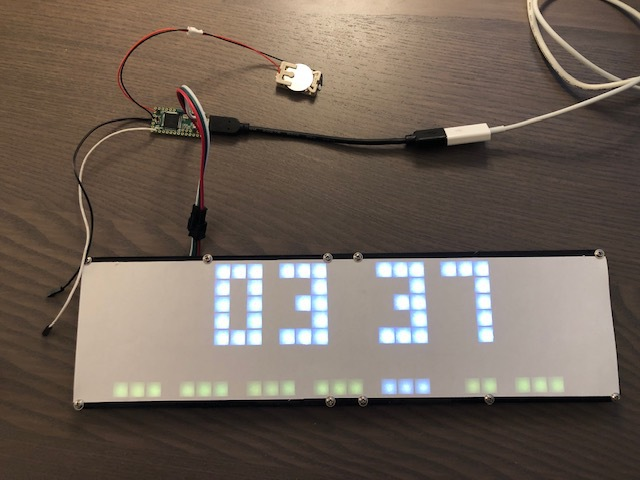
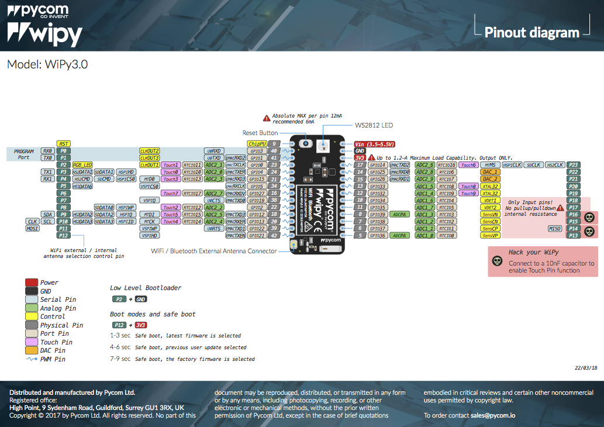

<!-- START doctoc generated TOC please keep comment here to allow auto update -->
<!-- DON'T EDIT THIS SECTION, INSTEAD RE-RUN doctoc TO UPDATE -->
**Table of Contents**  *generated with [DocToc](https://github.com/thlorenz/doctoc)*

- [Animated LED matrix display](#animated-led-matrix-display)
    - [Running the Python scripts](#running-the-python-scripts)
    - [Building and deploying the MCU](#building-and-deploying-the-mcu)
        - [Arduino](#arduino)
        - [MicroPython](#micropython)
    - [Configuring the Raspberry Pi](#configuring-the-raspberry-pi)
        - [Optional steps](#optional-steps)
    - [Hardware](#hardware)
        - [LED matrix display](#led-matrix-display)
        - [MCUs](#mcus)
            - [Teensy 3.1/3.2 pinout](#teensy-3132-pinout)
            - [WiPy 3.0 pinout](#wipy-30-pinout)
        - [Raspberry Pi](#raspberry-pi)
    - [On the serial protocol](#on-the-serial-protocol)
    - [Hacking](#hacking)
    - [Wiring things up](#wiring-things-up)
        - [LED matrix](#led-matrix)
        - [Button](#button)
        - [Connecting second UART on Pycom module to Raspberry Pi](#connecting-second-uart-on-pycom-module-to-raspberry-pi)
        - [Remote power management for Raspberry Pi](#remote-power-management-for-raspberry-pi)
- [Credits](#credits)

<!-- END doctoc generated TOC please keep comment here to allow auto update -->

# Animated LED matrix display

This is a project to drive a 8x32 (or 8x8) LED matrix based on the popular WS2812 RGB LEDs using a microcontroller and optionally control them both using a more powerful host computer, such as a Raspberry Pi Zero W.

The microcontroller is used to provide the accurate timing signals needed to control the WS2812 LEDs.  The microcontroller exposes a custom API over its USB serial interface to allow a more powerful computer to treat the display as a framebuffer connected over a serial link.

Currently this microcontroller can be either a Teensy 3.1/3.2 or one of [Pycom](https://www.pycom.io)'s development boards running [MicroPython](https://micropython.org) (e.g. WiPy 3.0).  For the Teensy, an Arduino [sketch](arduino/ArduinoSer2FastLED.ino) is provided which controls the WS2812 LEDs using the FastLED library and implements the serial protocol expected by the host software.  For boards running MicroPython a corresponding Python [implementation](pycomhal.py) is provided.

The host software is written in Python to allow for rapid development.

Features:

- button input(s)
- clock (short-press button to toggle between time and date)
- weather
- random animations

Static picture with clock scene.  For some reason the colors aren't captured as vidvid as they are in real life.




## Running the Python scripts

For Debian/Ubuntu derived Linux systems, try:

```bash
sudo apt install -y python-requests python-serial
```

On macOS, install pyserial (macOS already ships the requests module):

```bash
sudo -H easy_install serial
```

NOTE: There are known issues with hardware flow control and the driver/chip used in the Pycom modules (e.g. WiPy, LoPy).  This causes the host side scripts to overwhelm the microcontroller with data.  There do not appear to be any such issues with the Teensy on macOS.  There are no known issues with either module with recent Linux distributions, including Raspbian.

Connect the LED matrix to the microcontroller and then connect the microcontroller to your computer (via USB).  You should now be able to command the microcontroller to drive the display with:

```bash
python main.py
```

NOTES:

- The animation scene expects animated icons from a third-party source.  See the [animations/README.md](animations/README.md) for details on how to download them.
- The weather scene expects animated icons from a third-party source.  See the [weather/README.md](weather/README.md) for details on how to download them.


## Building and deploying the MCU 

The host-side Python code expects to be able to talk to the microcontroller over a serial protocol (running on top of USB serial).  Software that speaks this special protocol and can talk to the LED matrix needs to be loaded onto the microcontroller.

### Arduino

Assuming you have an MCU which is supported by Arduino, try:

1. Download the latest version of Arduino
2. In the _Library manager_, found via the menu entry _Tools > Manage Libraries..._, search for `fastled` and install the package
3. If you have a Teensy 3.x MCU, install the Arduino software add-on Teensyduino from https://www.pjrc.com/teensy/td_download.html
4. Connect the MCU to your computer using an USB cable
5. Open the Arduino sketch (project)
6. Setup the board under the _Tools_ menu, e.g. for a Teensy board:
  - Board: `Teensy 3.2 / 3.1`
  - Port: `/dev/tty.usbmodem575711` (exact path might depend on the specific board and OS)
7. Build (compile) the sketch via the menu entry _Sketch > Verify/Compile_
8. Upload the newly built sketch to the MCU via the menu entry _Sketch > Upload_


### MicroPython

[Connect](https://docs.pycom.io/gettingstarted/connection/) your Pycom module to your computer via USB (or 3.3v serial).  Open a serial connection to the module and [configure WiFi](https://docs.pycom.io/tutorials/all/wlan.html) in the REPL like this:

    from network import WLAN
    wlan = WLAN(mode=WLAN.STA)
    wlan.connect('yourSSID', auth=(WLAN.WPA2, 'yourPassword'))

Connect to the Pycom module's [native FTP server](https://docs.pycom.io/gettingstarted/programming/ftp.html) and login with `micro` / `python`.

Upload the following files to `/flash`:

- [main.py](main.py)

Upload the following files to `/flash/lib`:

- [clockscene.py](clockscene.py)
- [weatherscene.py](weatherscene.py)
- [ledmatrix.py](ledmatrix.py)
- [pycomhal.py](pycomhal.py)
- [urequests.py](urequests.py) (needed by `weatherscene.py`)
- [ws2812.py](ws2812.py)

Create a new directory under `/flash/animations` and upload any animation icons referenced in [config.json](config.json) (see [animations/README.md](animations/README.md) for details).

Create a new directory under `/flash/weather` and upload animated weather icons (see [weather/README.md](weather/README.md) for details).


If you haven't already, you probably want to read [Wiring things up](#wiring-things-up).


## Configuring the Raspberry Pi

If you want to run the Python scripts, install the necessary Python packages:

```bash
sudo apt install -y python-requests python-serial
# On Raspberry Pi Zero importing the Python `requests` package takes 20+ seconds
# if the python-openssl package is installed (default on Raspbian).
# https://github.com/requests/requests/issues/4278
#
# Uninstall it to speed up loading of `weatherscene.py`
sudo apt purge -y python-openssl
```

Install the support files:

- copy [gpio-shutdown.service](raspberry-pi/gpio-shutdown.service) into `/etc/systemd/system/`
- copy [lamatrix.service](raspberry-pi/lamatrix.service) into `/etc/systemd/system/`

Assuming you've cloned this repo at `/home/pi/lamatrix`, proceed as follows:

```bash
sudo apt install -y python-requests python-serial
cd ~/lamatrix

# Download animated weather icons (refer to weather/README.md)
curl -o weather/weather-cloud-partly.json https://developer.lametric.com/api/v1/dev/preloadicons?icon_id=2286
curl -o weather/weather-cloudy.json https://developer.lametric.com/api/v1/dev/preloadicons?icon_id=12019
curl -o weather/weather-moon-stars.json https://developer.lametric.com/api/v1/dev/preloadicons?icon_id=16310
curl -o weather/weather-rain-snow.json https://developer.lametric.com/api/v1/dev/preloadicons?icon_id=160
curl -o weather/weather-rain.json https://developer.lametric.com/api/v1/dev/preloadicons?icon_id=72
curl -o weather/weather-snow-house.json https://developer.lametric.com/api/v1/dev/preloadicons?icon_id=7075
curl -o weather/weather-snowy.json https://developer.lametric.com/api/v1/dev/preloadicons?icon_id=2289
curl -o weather/weather-thunderstorm.json https://developer.lametric.com/api/v1/dev/preloadicons?icon_id=11428

# Install and start services
chmod +x main.py raspberry-pi/gpio-shutdown.py
sudo cp raspberry-pi/gpio-shutdown.service /etc/systemd/system
sudo cp raspberry-pi/lamatrix.service /etc/systemd/system
sudo systemctl daemon-reload
sudo systemctl enable gpio-shutdown.service lamatrix.service
sudo systemctl start gpio-shutdown.service lamatrix.service
```

NOTE: If you're not running under the `pi` user or have placed the files somewhere else than `/home/pi/lamatrix` you will have to update the `ExecPath=`, `User=` and `Group=` attributes in the `.service` files accordingly.

Your Raspberry Pi will now poweroff when board pin number 5 (a.k.a BCM 3 a.k.a SCL) goes LOW (e.g. is temporarily tied to ground).  The shutdown process takes 10-15 seconds.  The Pi can be powered up by again temporarily tying the pin to ground again.

To actually make use of the remote shutdown and reboot feature you need to physically wire the microcontroller to the Raspberry Pi.  Connect the microcontroller's `GND` (ground) to one of the `GND` pins on the Raspberry Pi.  Connect pin 14 (see `HOST_SHUTDOWN_PIN` in [ArduinoSer2FastLED.ino](arduino/ArduinoSer2FastLED.ino)) on the microcontroller to the Raspberry Pi's [BCM 3 a.k.a SCL](https://pinout.xyz/pinout/i2c).


### Optional steps

If you're running a headless Raspberry Pi you can reduce the boot time by a few seconds with:

```bash
sudo apt-get purge -y nfs-common libnfsidmap2 libtirpc1 rpcbind python-openssl
grep -q boot_delay /boot/config.txt || echo boot_delay=0 |sudo tee -a /boot/config.txt
sudo systemctl disable dphys-swapfile exim4 keyboard-setup raspi-config rsyslog
```

(the `python-openssl` package slows down the import of the `python-requests` package: https://github.com/requests/requests/issues/4278)


## Hardware

### LED matrix display

On popular auction sites there are 8x8, 8x32 and 16x16 flexible LED matrix displays with WS2812 LEDs if you search for e.g. `LED Matrix WS2812 5050 flexible`:

.

Price: €35-45

For the 8x32 variant, you can 3D print a frame from these objects:

- [32x8 LED Matrix grid for diffuser](https://www.thingiverse.com/thing:1903744)
- [8x32-ledmatrix-back.scad](8x32-ledmatrix-back.scad) (customize it in [OpenSCAD](https://www.openscad.org/downloads.html), hit Render (F6) and export it as STL)

For diffusing the light emitted by the LEDS a paper works suprisingly well if it's tightly held to the grid.


### MCUs

- [https://www.pjrc.com/teensy/](Teensy) (for Teensy 3.1/3.2, solder a 32.768kHz crystal to allow for [time-keeping via a battery](https://www.pjrc.com/teensy/td_libs_Time.html))
  - Teensy 3.2: ARM Cortex-M4 72MHz, 64kBytes SRAM, 256kBytes flash, RTC (requires 32kHz crystal and a 3V battery)
  - Price: €20-25
  - Specs and pinout: https://www.pjrc.com/teensy/teensyLC.html
- [WiPy 3.0](https://pycom.io/product/wipy-3-0/) and an [Expansion Board 3.0](https://pycom.io/product/expansion-board-3-0/) for easy programming via USB
  - ESP-32 platform, 520kBytes SRAM + 4MBytes (external) pSRAM, 8MBytes flash, 802.11b/g/n 16Mbps WiFi
  - Price: €20-25
  - Docs and pinout: https://docs.pycom.io/datasheets/development/wipy3
  - Expansion Board docs: https://docs.pycom.io/datasheets/boards/expansion3

Both alternatives support both Arduino and MicroPython.

NOTE: it seems that hardware flow control between pyserial and the Pycom modules (e.g. WiPy, LoPy) doesn't work properly for some reason.  This results in the host overwhelming the microcontroller with data, leading to data loss in the serial protocol which in turn messes up what is displayed on the LED matrix.  The Teensy 3.x boards work without problems however.


#### Teensy 3.1/3.2 pinout


Source: https://www.pjrc.com/teensy/teensyLC.html


#### WiPy 3.0 pinout



Source: https://docs.pycom.io/datasheets/development/wipy3.html


### Raspberry Pi

Newer Raspberry Pi computers have a non-populated RUN pin (marked with a square) that, if tied to ground, will reset the Pi's CPU.  See this answer on [What are the RUN pin holes on Raspberry Pi 2?](https://raspberrypi.stackexchange.com/questions/29339/what-are-the-run-pin-holes-on-raspberry-pi-2/33945#33945).

Since there is a 10k pull-up resistor connected to this pin, the Pi will turn on again when this pin is no longer tied to ground.  The drawback is of course that resetting the CPU leads to an unclean shutdown of the Pi, which in turn might lead to SD card corruption.

A Raspberry Pi which has previously been shutdown using e.g. `sudo poweroff` can be brought back to life by temporarily grounding GPIO 5 (a.k.a BCM 3 a.k.a SCL).  With the help of a small Python script running in the background we can make GPIO 5 an input pin and watch for level changes.  If this pin becomes LOW (i.e. tied to ground) we can initiate a clean shutdown with `sudo systemctl poweroff --force`.

Example from [raspberry-pi/gpio-shutdown.py](raspberry-pi/gpio-shutdown.py):

```python
#!/usr/bin/python
#
# Watch the board pin number 5 for level changes and initiate a power-off
# when this pin goes low.
#
from RPi import GPIO
from subprocess import call

# https://pinout.xyz/pinout/i2c
pin = 5  # a.k.a BCM 3 a.k.a SCL

GPIO.setmode(GPIO.BOARD)
GPIO.setup(pin, GPIO.IN)
GPIO.wait_for_edge(pin, GPIO.FALLING)
print('GPIO 5 dropped to low, initiating poweroff')
call(["/bin/systemctl","poweroff","--force"])
```


## On the serial protocol

Because of the limited amount of memory available on MCU it was decided to use a more powerful computer to render things on the LED matrix display.  The most natural way of connecting a MCU and a host computer is to use the serial interface available on many popular MCUs, and thus a serial protocol was born.

To add new functionality to the serial protocol, ensure that you make the necessary updates in:

- the MCU implementation on the Arduino side, in and around `loop()`
- the MCU implementation on the MicroPython side, in `pycomhal.py`
- the host computer implementation, in `arduinoserialhal.py`


## Hacking

In short:

- on the host-side, everything starts in [main.py](main.py)
  - somewhat confusingly this file is also the entrypoint for microcontrollers running MicroPython
- `main.py` has a `RenderLoop` which consumes _scenes_ (e.g. a [clock](clockscene.py) scene, a [weather](weatherscene.py) scene, ..)
- a framebuffer wrapper around the LED matrix display is in [ledmatrix.py](ledmatrix.py)
  - this is used primarily for the host-side but is also used on microcontrollers running MicroPython
- the framebuffer wrapper does low-level display operations via a HAL (hardware abstraction layer)
  - on the host-side this is implemented in [arduinoserialhal.py](arduinoserialhal.py)
  - on the host-side this file pretty much opens a serial port and speaks a custom protocol to command the microcontroller to do things
- on the microcontroller-side the custom protocol is implemented in:
  - [ArduinoSer2FastLED.ino](arduino/ArduinoSer2FastLED.ino) for devices running Arduino
  - [pycomhal.py](pycomhal.py) for Pycom devices running MicroPython


To add a new scene, create a Python module (e.g. `demoscene.py`) like this:

```python
#!/usr/bin/env python
class DemoScene:
    """This module implements an example scene with a traveling pixel"""

    def __init__(self, display, config):
        """
        Initialize the module.
        `display` is saved as an instance variable because it is needed to
        update the display via self.display.put_pixel() and .render()
        """
        self.display = display
        self.x_pos = 0  # ..just an example
        print('DemoScene: yay, initialized')

    def reset(self):
        """
        This method is called before transitioning to this scene.
        Use it to (re-)initialize any state necessary for your scene.
        """
        self.x_pos = 0
        print('DemoScene: here we go')

    def input(self, button_id, button_state):
        """
        Handle button input
        """
        print('DemoScene: button {} pressed: {}'.format(button_id, button_state))
        return False  # signal that we did not handle the input

    def render(self, frame, dropped_frames, fps):
        """
        Render the scene.
        This method is called by the render loop with the current frame number,
        the number of dropped frames since the previous invocation and the
        requested frames per second (FPS).
        """

        time_in_seconds = frame * fps
        if not time_in_seconds.is_integer():
            # Only update pixel once every second
            return True

        y = 3
        color = 64
        self.display.clear()
        self.display.put_pixel(self.x_pos, y, color, color, color >> 1)
        self.display.render()
        print('DemoScene: rendered a pixel at ({},{})'.format(self.x_pos, y))

        self.x_pos += 1
        if self.x_pos == self.display.columns:
            return False   # our work is done!

        return True   # we want to be called again

if __name__ == '__main__':
    display = None
    config = None
    scene = DemoScene(display, config)
    scene.reset()
```

Then open [main.py](main.py) and locate the following line:

```python
r = RenderLoop(display, fps=10)
```

Below it, create an instance of your module and call `RenderLoop.add_scene()` to add it to the list of scenes.  If your module is named `demoscene.py` and implements the `DemoScene` class it should look something like this:

```python
from demoscene import DemoScene
scene = DemoScene(display, config['DemoScene'])
r.add_scene(scene)
```

You should also add a `"DemoScene": {},` block to the config file `config.json`.  Store any settings your scene needs here.

With these steps completed, the scene's `render()` method should now eventually be called when you run the host-side software (e.g. `python main.py`).  The method should return `True` until you're ready to hand over control to the next scene, in which case you signal this by returning `False`.


## Wiring things up

To the extent possible I've attempted to choose the same set of board pins on both MCUs (microcontrollers).

A short note on pin mappings:

- physical pin numbering refer to the chip's physical pins
- GPIO pin number refer to the chip's internal GPIO pin numbering (e.g. `GPIO22` as shown in pinout mappings)
- board pin numbering refer to the pins as made available on the PCB, with pin 0 or 1 often being in the top left corner after excluding any power/ground/reset pins
- pin ID as mapped in firmware, e.g. _digital pin_ number 10 or _P10_ (as shown in pinout mappings)

### LED matrix

Connect the display like this:

    LED matrix:  5V --> MCU: Vin pin (voltage in)
    LED matrix: GND --> MCU: GND pin
    LED matrix: DIN --> MCU: digital pin 6 on Teensy; P11 (a.k.a GPIO22) on Pycom module


### Button

Connect the button like this:

    Button pin 1 --> MCU: digital pin 12 on Teensy; P12 (a.k.a. GPIO21) pin on Pycom module
    Button pin 2 --> MCU: GND pin


### Connecting second UART on Pycom module to Raspberry Pi

To connect the Pycom module's (e.g. WiPy) second UART (3.3V serial port) to the Raspberry Pi's UART, connect:

    Raspberry Pi: board pin  8 (TXD) --> MCU: P4 (a.k.a RX1 a.k.a GPIO15) on Pycom module
    Raspberry Pi: board pin 10 (RXD) --> MCU: P3 (a.k.a TX1 a.k.a GPIO4) on Pycom module
    Raspberry Pi: board pin  6 (GND) --> MCU: GND pin

NOTE: Raspberry Pi modules with built-in WiFi/Bluetooth needs the following line in `/boot/config.txt` to [free up the TXD/RXD pins](https://www.raspberrypi.org/documentation/configuration/uart.md):

    dtoverlay=pi3-disable-bt

Running `screen /dev/serial0 115200` on the Raspberry Pi should now allow you to see data sent from the MCU's second UART.


### Remote power management for Raspberry Pi

To let the MCU manage the Raspberry Pi's power, connect:

    Raspberry Pi: board pin 5 (a.k.a SCL) --> MCU: digital pin 8 on Teensy; P8 (a.k.a GPIO2) on Pycom module
    Raspberry Pi: board pin 6 (a.k.a GND) --> MCU: GND pin


# Credits

Several animations in the form of `.json` files were backed up from LaMetric's developer API.  Credit goes to the original authors of these animations.

The [urequests.py](urequests.py) file is a slightly modified copy from [micropython/micropython-lib](https://github.com/micropython/micropython-lib).

The [ws2812.py](ws2812.py) file, a MicroPython implementation for controlling WS2812 LEDs, is based on work published on [JanBednarik/micropython-ws2812](https://github.com/JanBednarik/micropython-ws2812).
